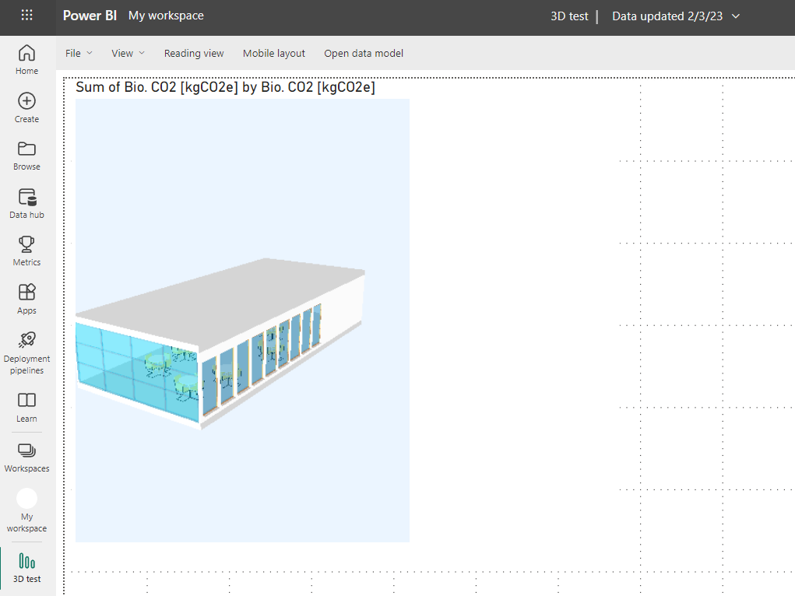

# Power BI 3D
**#this is still a work in progress, feel free to fork and contribute**
 
This is a fork of the [PowerBI3D repository](https://github.com/diego-apellaniz/PowerBI3D) that uses the threejs ifcloader to visualize *.ifc models in Power BI.
This version only supports IFC files.

## Acknowledgement
This custom visual was developed by [Diego Apellániz](https://github.com/diego-apellaniz/PowerBI3D).    

## Features
✅ Filtering: slicer -> model  
✅ Filtering: model -> other visuals  
🟩 Conditional coloring based on db values  
🟩 Allowing user to upload files in the format tab to avoid issues with COR 
✅ there seems to be an issue with fetching web-ifc.wasm  
    -> turned out to be an issue with IFCLoader.js  
    -> i botched by changing line 3345 in web-ifc-three@0.0.122/IFCLoader.js  
    -> from  this.state.api.SetWasmPath(path);  
    -> to    this.state.api.SetWasmPath(path, true);  
    -> this should also solve the issue described here   
    -> https://community.powerbi.com/t5/Developer/Adding-threejs-to-a-custom-visual/m-p/2181493/highlight/true#M32829  
    

