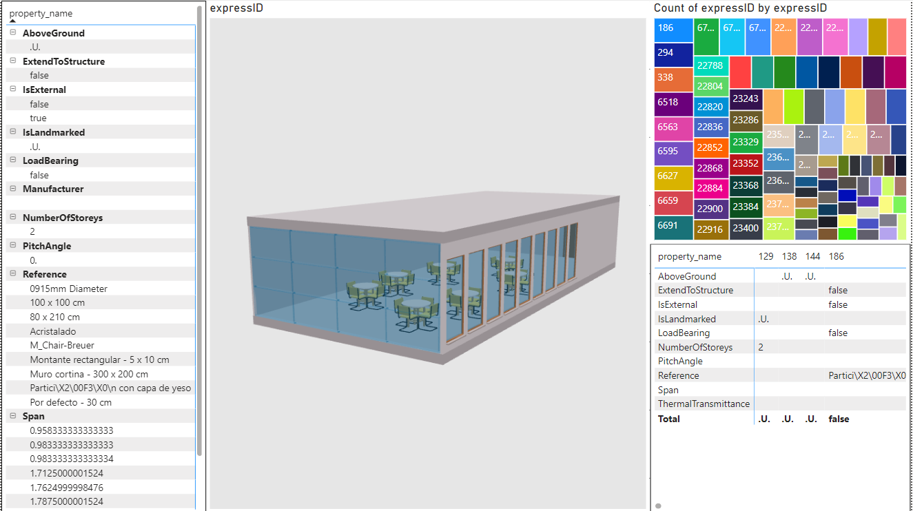

# Power BI 3D
**#this is still a work in progress, feel free to fork and contribute**
 
This is a fork of the [PowerBI3D repository](https://github.com/diego-apellaniz/PowerBI3D) that uses the threejs ifcloader to visualize *.ifc models in Power BI.
This version only supports IFC files.

## Acknowledgement
This custom visual was initially developed for 3DM by [Diego Apellániz](https://github.com/diego-apellaniz/PowerBI3D).    

## Features
✅ Filtering: slicer -> model  
✅ Filtering: model -> other visuals  
✅ Conditional coloring based on db values  
✅ Allowing user to upload files in the format tab to avoid issues with COR  
✅ there seems to be an issue with fetching web-ifc.wasm  
🟦 to migrate from web-ifc-three to web-ifc-viewer to gain more prebuilt functions  
🟦 add another layer on top of base ifc to render simple geometries.  
    to indicate locations of defects on top of the ifc model   
    the geometries should be defined in power query, then rendered directly in three.js
  
  
&nbsp;&nbsp;&nbsp;&nbsp;&nbsp;&nbsp;&nbsp;&nbsp;updated 2023-05-10  
&nbsp;&nbsp;&nbsp;&nbsp;&nbsp;&nbsp;&nbsp;&nbsp;-> turned out to be an issue with IFCLoader.js  
&nbsp;&nbsp;&nbsp;&nbsp;&nbsp;&nbsp;&nbsp;&nbsp;-> i botched by changing line 3345 in web-ifc-three@0.0.122/IFCLoader.js  
&nbsp;&nbsp;&nbsp;&nbsp;&nbsp;&nbsp;&nbsp;&nbsp;-> from this.state.api.SetWasmPath(path);  
&nbsp;&nbsp;&nbsp;&nbsp;&nbsp;&nbsp;&nbsp;&nbsp;-> to this.state.api.SetWasmPath(path, true);  
&nbsp;&nbsp;&nbsp;&nbsp;&nbsp;&nbsp;&nbsp;&nbsp;-> this should also solve the issue described here   
&nbsp;&nbsp;&nbsp;&nbsp;&nbsp;&nbsp;&nbsp;&nbsp;-> https://community.powerbi.com/t5/Developer/Adding-threejs-to-a-custom-visual/m-p/2181493/highlight/true#M32829  
&nbsp;&nbsp;&nbsp;&nbsp;&nbsp;&nbsp;&nbsp;&nbsp;updated 2023-05-11  
&nbsp;&nbsp;&nbsp;&nbsp;&nbsp;&nbsp;&nbsp;&nbsp;-> found a way to make it work the right way. 
&nbsp;&nbsp;&nbsp;&nbsp;&nbsp;&nbsp;&nbsp;&nbsp;-> just have to alter the parameters of web-ifc-api from ifc loader.  
&nbsp;&nbsp;&nbsp;&nbsp;&nbsp;&nbsp;&nbsp;&nbsp;-> ifcLoader.ifcManager.state.api['isWasmPathAbsolute'] = true;  
&nbsp;&nbsp;&nbsp;&nbsp;&nbsp;&nbsp;&nbsp;&nbsp;-> ifcLoader.ifcManager.state.api['wasmPath'] = "https://unpkg.com/web-ifc@0.0.36/";  
&nbsp;&nbsp;&nbsp;&nbsp;&nbsp;&nbsp;&nbsp;&nbsp;updated 2023-05-15  
&nbsp;&nbsp;&nbsp;&nbsp;&nbsp;&nbsp;&nbsp;&nbsp;-> users are now able to uplaod a ifc file to the visual and the file will persist even after the PBi is closed.   
&nbsp;&nbsp;&nbsp;&nbsp;&nbsp;&nbsp;&nbsp;&nbsp;-> not sure what is the file size limit, it works for <50MB ifc files.  
&nbsp;&nbsp;&nbsp;&nbsp;&nbsp;&nbsp;&nbsp;&nbsp;-> works on PowerBI web app (you will need a pbi pro or premium license to share)  
